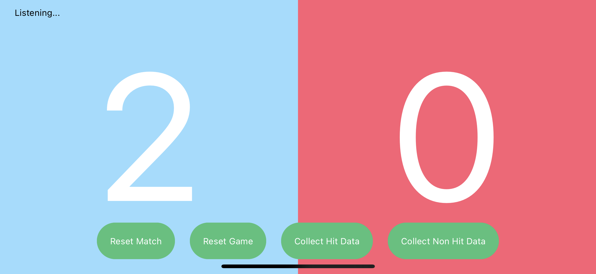
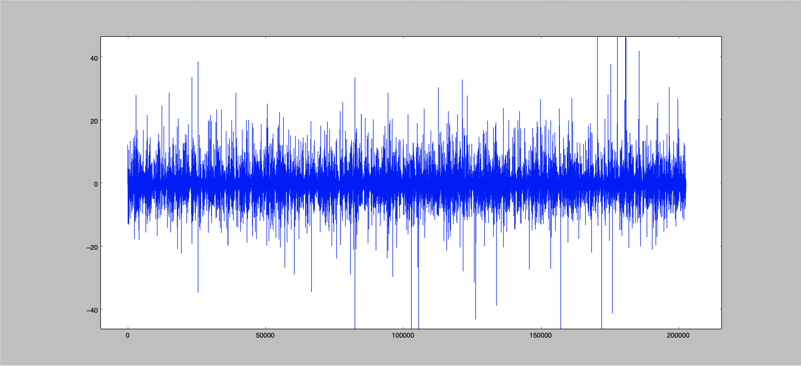
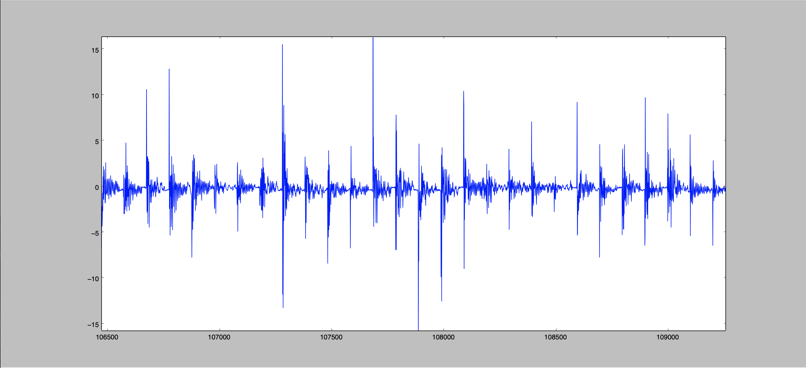

# umpire-ai

:white_check_mark: Completed  
:white_circle: Partially Completed  
:large_blue_circle: In progress  
:red_circle: Todo  

### Tasks
* Sensors  
  :white_check_mark: Connect two MPU6050 Inertial Measurement Units (IMUs) through I2C bus  
  :white_check_mark:Develop algorithm to capture relevant data when an acceleration threshold is hit due to a ball hitting the table  
  :white_check_mark:Save 100 data points into a file for each hit (See "Data Collection" section)  
  :large_blue_circle: Calibrate the IMUs only when the table is parallel to the ground  
  :large_blue_circle: Stop calibration when the table is folded (perpendicular to the ground)  
* Microcontroller (ESP32)
  :white_check_mark: Bringup device with FreeRTOS
* Table Tennis Game Mechanics Algorithm  
  :white_check_mark: Implement game mechanics state machine  
  :white_circle: Decide when a point should be awarded and to whom (there are still some table tennis rules not taken into consideration)  
  :white_check_mark: Allow game resets  
  :red_circle: Award point immediately to the other side when there is a double bounce on one side  
* Bluetooth Low Energy  
  :white_check_mark: Connect ESP32 to the iPad application  
  :white_check_mark: Send game state to the iPad application in real time  
  :white_check_mark: Send scores to the iPad application  
  :white_check_mark: Receive "game reset" command from the iPad application to zero out scores and reset the current game  
  :red_circle: Enable the Bluetooth File Transfer Profile  
  :red_circle: Allow the binary data file to be transmitted over Bluetooth to the iPad application  
* Data Collection  
  :white_check_mark: Implement a file system on the ESP32  
  :white_check_mark: Create a binary file to store sensor data whenever there is a hit on the table  
  :white_check_mark: Whenever there is a hit on the table, 100 data points are written into the binary file  
  :red_circle: Newly created files should be named differently from the previous one instead of overwriting it  
  :red_circle: When the file is transmitted to the iPad application, rename it so that it reflects the current date or the date it was trasnmitted  
  :red_circle: If there are multiple files transmitted on the same day, name them sequencially  
* Auxiliary  
  :white_check_mark: Python scripts to visualize collected sensor data  
* iPad application: https://github.com/gggonzalez03/umpire-ai-ios  

### Tests and Results
The device is installed on a foldable table tennis table and used for more than 10 games each session. There have been two sessions so far where data is collected, saved, and downloaded into a computer (they are in this repository under the ```helper_python_files``` folder). With the iPad application (screenshot below), the user is informed that the UmpireAI device is connected when it says "Listening..." at the top left of the screen. The scores are also displayed on the screen in real time. Most of the buttons are not functional yet, only the reset match is.

The scoring system works smoothly except when there are any disturbances on the table tennis table, such as a player's hand touching the table in the middle of the game, paddle hitting the table, or any other budge on the table. Also, when there is a double bounce on one side of the table, it does not automatically award a point to the opponent. This can easily be fixed by modifying the algorithm. However, the effect of disturbances are still yet to be solved because the machine learning model is not ready yet. We hope to work more on the model once more data is collected by playing more games.

Note that the AI part of the project is handled by my partner Abhaya Karmacharya.

### Screenshots
1. UmpireAI iOS Screenshot

2. Collected Sensor Data - First Session (Zoomed Out)

3. Collected Sensor Data - First Session (Zoomed In)
